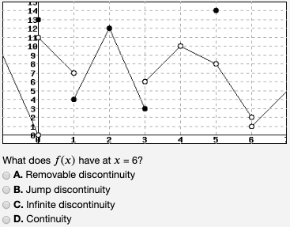

# WeBHuoeR: Repo of WeBWorK Problems

## Identify limits from a (randomized) graph: [limits.pg](limits.pg)
Every student gets a completely different graph. Here are a couple examples.

 

## Identify discontinuities from a (randomized) graph: [discts.pg](discts.pg)

